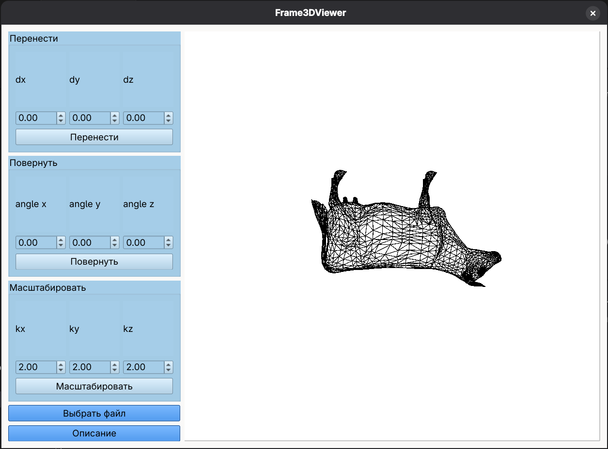
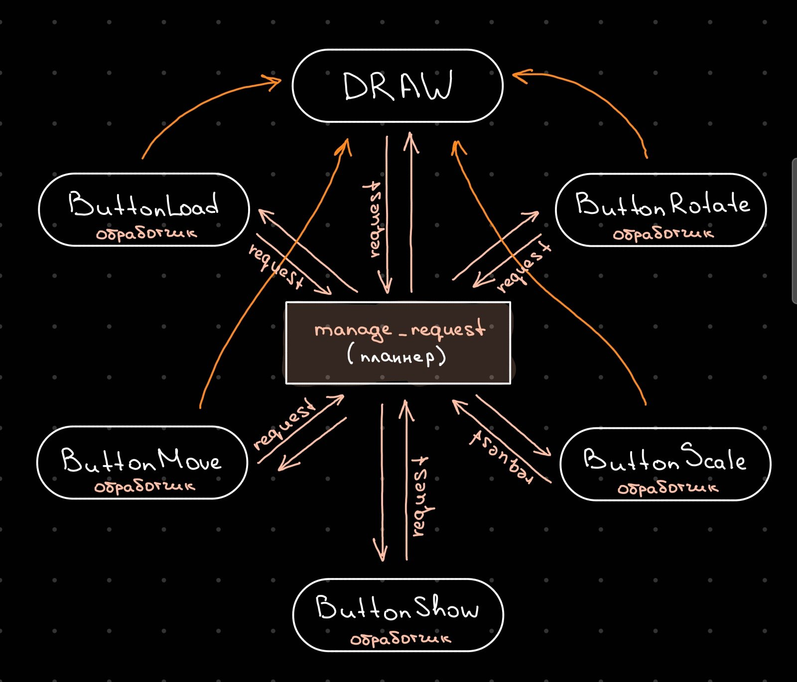

# Лабораторная работа №1: "Каркасный 3D viewer"

Создать каркасный 3D-viewer.



# Qt. Начало

## Структура проекта

Структура приложения Qt различается от реализации к реализации и зависит от нескольких аспектов, начиная от списка используемых утилит и заканчивая собственно тем, как именно автор проекта хочет его организовать. 

В данной реализации непосредственно расположение файлов и ресурсов проекта будет подчиняться примерно следующим правилам:

```
📦 app
├── 📄 app.pro 
├── 📂 headers
│   ├── 📄 file_1.h
│   └── 📄 file_2.h  
├── 📂 sources
│   ├── 📄 main.cpp
│   ├── 📄 file_1.cpp
│   └── 📄 file_2.cpp
├── 📂 forms
│   ├── 📄 file_1.ui
│   └── 📄 file_2.ui
└── 📂 figures
    ├── 📄 file_1.txt
    └── 📄 file_2.txt
```

## Что такое app.pro

> [!NOTE]
> Файл ```.pro``` используется для создания кроссплатформенных приложений на основе Qt;содержит инструкции для компилятора, определяющие, как собирать приложение, библиотеку или плагин. 

Файл ```.pro``` содержит всю информацию, необходимую qmake для создания приложения, библиотеки или плагина. В частности, файл проекта содержит ряд объявлений для указания ресурсов, таких как ссылки на исходные файлы и файлы заголовков, библиотеки, необходимые проекту и т.д. 

> [!IMPORTANT]
> Говоря простым языком, написание несложного по своей сути ```.pro``` файла позволит автоматически сгенерировать нужный для сборки проекта ```Makefile```.

Функционал ```.pro``` чем-то напоминает функционал ```Makefile```, однако это разные вещи: 
- ```.pro```: описывает то, что есть в проекте (файлы, модули Qt, настройки, переменные qmake), то есть всю информацию, необходимую qmake для сборки приложения. Поддержка простых конструкций программирования позволяет описывать разные процессы сборки для разных платформ и окружений, что делает его кроссплатформенным.
- ```Makefile```: в упрощенном понимании содержит набор инструкций для компилятора, который собирает проект. Зависит от платформы, может генерироваться qmake из .pro, но также создаётся вручную или другими инструментами вроде CMake.

Qt предлагает отказаться от времяпрепровождения за написанием ```.pro``` файла и ```Makefile```, предоставляя пользователю возможность сгенерировать их своими средствами. Последовательность команд ниже позволяет автоматически собрать приложение:

```bash
qmake -project  // автоматическое создание .pro
qmake app.pro // автоматическое создание Makefile
make  // запуск созданного Makefile
```

... чем мы, разумеется, пользоваться не будем из соображений упрямства, а также необходимости гибко настраивать собственный проект: так как пул ошибок в духе

```bash
sources/main.cpp:2:10: fatal error: mainwidget.h: No such file or directory
    2 | #include "mainwidget.h"
```

и 

```bash
sources/main.cpp:1:10: fatal error: QtWidgets: No such file or directory
    1 | #include <QtWidgets>
```

крайне велик, то для небольших проектов есть смысл расщедриться на хотя бы один вручную написанный ```.pro``` файл, из которого потом можно будет без усилий сгенерировать ```Makefile```.

Итак, необходимо создать ```.pro``` файл (с официальной документацией к ```Qt project files``` можно ознакомиться [здесь](https://doc.qt.io/qt-6/qmake-project-files.html)).

По своей сути создание ```.pro``` файла - это указание значения ряда необходимых в рамках вашего проекта переменных. Именно эти переменные будут определять то, как именно будет генерироваться ```Makefile``` на основе вашего ```.pro``` файла. Вот несколько из них:

| Переменная  | Назначение |
|    :---:    |------------|
|   TEMPLATE  | Шаблон, используемый в проекте. Определяет то, чем будет проект после компиляции, приложением, библиотекой или плагином. |
|      QT     | Список модулей Qt, используемых в проекте. |
|   HEADERS   | Список имён заголовочных файлов (.h) и путей к ним. |
|   SOURCES   | Список файлов исходных кодов, которые используются при сборке проекта. |
|    FORMS    | Список UI файлов, которые реализуют пользовательский интерфейс. |
|   DESTDIR   | Директория, в которую будет помещён бинарник или исполняемый файл. |
| INCLUDEPATH | Пути, содержащие заголовочные файлы. |

Полный список переменных ```.pro``` файла можно посмотреть [здесь](https://doc.qt.io/qt-6/qmake-variable-reference.html).

Таким образом, ```app.pro``` файл для данной структуры проекта может выглядеть следующим образом:

```
TEMPLATE = app
TARGET = Frame3DViewer
QT += core widgets gui

# Папки проекта
HEADERS_DIR = headers
SOURCES_DIR = sources
FORMS_DIR = forms

# Пути для компиляции
INCLUDEPATH += $$HEADERS_DIR

# Файлы проекта
SOURCES += $$files($$SOURCES_DIR/*.cpp)
HEADERS += $$files($$HEADERS_DIR/*.h) \
           $$files($$HEADERS_DIR/*/*.h) 
FORMS += $$files($$FORMS_DIR/*.ui)

# Папка для сборки
DESTDIR = build
OBJECTS_DIR = build/obj
MOC_DIR = build/moc
UI_DIR = build/ui
```

> [!IMPORTANT]
> Чтобы сгенерировать ```Makefile``` на основе ```.pro``` файла, необходимо выполнить:
> ```bash
> qmake app.pro // автоматическое создание Makefile
> ```

После чего можно уже вызывать ```Makefile```, который и создаст бинарный файл, при запуске которого появится приложение.

## Основы создания приложений: нажатие на кнопку

Сейчас ```mainwidget.cpp``` выглядит так:

```cpp
#include "mainwidget.h"      // подключение заголовочных файлов
#include "ui_mainwidget.h"   // подключение заголовочных файлов

/* инструкции для компилятора, что именно надо сделать при создании
объекта класса MainWidget*/
MainWidget::MainWidget(QWidget *parent) : QWidget(parent), ui(new Ui::MainWidget)
{
   ui->setupUi(this);  // построение интерфейса
}

MainWidget::~MainWidget()  // описание деструктора
{
   delete ui;
}
```

Здесь указаны основные моменты, которыми будут общими в принципе для всех случаев создания приложения. Если синтаксис самого языка не совсем понятен, то рекоментуется начать с чтения [руководства](https://learn.microsoft.com/ru-ru/cpp/cpp/classes-and-structs-cpp?view=msvc-170) по классам. Теперь необходимо создать метод класса, который будет отвечать за выбор и загрузку файлов. Для этого в свою очерень нужно конкретезировать, какие именно файлы мы хотим использовать в проекте, а мы хотим использовать файлы ```.txt``` для упрощения процесса.

Пример ```.txt``` файла, который будет корректно обрабатываться нашей программой:

```
4
-200 -200 0
200 -200 0
200 200 0
-200 200 0
4
0 1
0 3
3 2
2 1
```

В первой строке указывается количество точек фигуры. На каждой следующей строке указываются координаты (x, y, z) каждой из точек. Затем указано количество ребер фигуры, а за ней на каждой строке отдельно указываются "связи ребер" (нумерация начинается с 0). Таким образом ребро 0 связано с ребром 1, с ребром 3, ребро 3 связано с ребром 2 и т.д. Не трудно догадаться, что данная фигура - квадрат в плоскости ```(x, y)```.

Создадим метод класса, который будет предлагать пользователю диалоговое окно, выбор ```.txt``` файла в нем, а затем будет выводить имя полученного файла в консоль.

```cpp

status_t MainWidget::ButtonLoadFile_clicked()
{
   QString path = QFileDialog::getOpenFileName(this, "Выбор файла", "", "Text files (*.txt)");
   cout << path.toUtf8().data() << endl;

   return SUCCESS;
}
```

Обновим класс MainWidget, добавив в ```private slots```  ButtonLoadFile_clicked():

```cpp
class MainWidget : public QWidget
{
    Q_OBJECT

    public:
        explicit MainWidget(QWidget *parent = nullptr);
        ~MainWidget();

    private:
        Ui::MainWidget *ui; 

    private slots:
        status_t ButtonLoadFile_clicked();
};
```

Последний этап: привяжем кнопку ```ButtonLoadFile``` из нашего ui к методу данного класса:

```cpp
MainWidget::MainWidget(QWidget *parent) : QWidget(parent), ui(new Ui::MainWidget)
{
   ui->setupUi(this);

   connect(ui->ButtonLoadFile, &QPushButton::clicked, this, &MainWidget::ButtonLoadFile_clicked);
}
```

Теперь при нажатии ```ButtonLoadFile``` в консоль будет выводиться имя файла, который мы выбрали.

## Логика 3D viewer

Рассмотрим логику работы viewer и то, как именно взаимодействие с интерфейсом программы конвертируется в реальные события. 


Что происходит в общем случае, когда пользователь нажимает на кнопку? Расмотрим на примере функций, которые реализуются относительно просто - это обработка нажатий кнопок "Описание" и "Выбрать файл".

Итак, пользователь нажимает на кнопку "Выбрать файл", после чего выполняется функция, связанная непосредственно с обработкой самого нажатия:

```cpp
status_t MainWidget::ButtonLoadFile_clicked()
{
   status_t sc = SUCCESS;
   request_t request;
   
   QString path = QFileDialog::getOpenFileName(this, "Выбор файла", "", "Text files (*.txt)");

   request.type = LOAD_FIGURE;
   request.filename = path.toUtf8().data();

   sc = manage_request(request, this->figure);
   if (sc == SUCCESS) sc = draw();

   show_error_message(sc, this);

   return sc;
}
```

Здесь можно видеть, во-первых, определение статуса завершения функции (все функции возвращают статус своего завершения, в некотором роде это считается хорошим тоном, о чем мы знаем по крайней мере от [этого](https://iu7.bmstu.ru/teachers/%D0%B1%D0%B5%D0%BA%D0%B0%D1%81%D0%BE%D0%B2-%D0%B4%D0%B5%D0%BD%D0%B8%D1%81-%D0%B5%D0%B2%D0%B3%D0%B5%D0%BD%D1%8C%D0%B5%D0%B2%D0%B8%D1%87/) авторитетного человека). Далее объявляется переменная ```request```. Она используется почти всеми функциями-обработчиками и играет важную роль в обмене информацией между модулями программы, так как содержит необходимую информацию:

```cpp
typedef struct
{
    request_type_t type;
    draw_scene_t scene;
    union
    {
        const char *filename;
        move_data_t move_data;
        scale_data_t scale_data;
        rotate_data_t rotate_data;
    };
} request_t;
```

Заметим, что имя файла, данные о передвижении фигуры, масштабировании фигуры и повороте фигуры, которые передает ```request``` заключены в ```union```, что позволяет оптимизировать работу с памятью. Соответственно, когда вызывается функция-обработчик нажатия кнопки, ```request``` получает две вещи:

1. Тип действия (то есть ЧТО именно должна сделать программа).
2. Дополнительные данные, необходимые для выполнения этого действия.

А дальше ```request``` отправляется... дальше, в функцию ```manage_request```, которая и является тем самым "планнером", определяющим дальнейшие действия программы:

```cpp
status_t manage_request(request_t &request, figure_t &figure)
{
    status_t sc = SUCCESS;
    switch (request.type)
    {
        case LOAD_FIGURE:
            sc = read_figure_from_file(figure, request.filename);
            break;

        case DRAW_FIGURE:
            sc = draw_figure(figure, request.scene);
            break;
            
        case MOVE_FIGURE:
            sc = move_figure(figure, request.move_data);
            break;

        case SCALE_FIGURE:
            sc = scale_figure(figure, request.scale_data);
            break;

        case ROTATE_FIGURE:
            sc = rotate_figure(figure, request.rotate_data);
            break;

        default:
            sc = ERR_UNDEFINED;
    }

    return sc;
}
```

Именно ```manage_request``` определяет, какая функция будет вызвана далее. В нашем случае вызывается ```read_figure_from_file```, которая в свою очередь может вызывать свои другие функции и т.д. и т.п. Нас интересуют в частности дальнейшие действия. Сама по себе ```read_figure_from_file``` также возвращает статус своего завершения, который передается по иерархии в ```manage_request```:

```cpp
case LOAD_FIGURE:
    sc = read_figure_from_file(figure, request.filename);
    break;
```

... а она также передает этот статус выше. Таким образом, после того, как планнер выполнил свою задачу, управление снова оказывается в функции-обработчике ```ButtonLoadFile_clicked```:

```cpp
status_t MainWidget::ButtonLoadFile_clicked()
{
    // ...
    sc = manage_request(request, this->figure);
    if (sc == SUCCESS) sc = draw();

    show_error_message(sc, this);

    return sc;
}
```

Итак, статус завершения работы подпрограмм проверяется, и, если в процессе не возникло никаких ошибок, то выполняется функция отрисовки:

```cpp
status_t MainWidget::draw()
{
   status_t sc;
   request_t request;
   QGraphicsScene *scene;
   double scene_width, scene_height;

   auto rcontent = ui->graphicsView->contentsRect();
   ui->graphicsView->scene()->setSceneRect(0, 0, rcontent.width(), rcontent.height());

   scene = ui->graphicsView->scene();
   scene_width = ui->graphicsView->scene()->width();
   scene_height = ui->graphicsView->scene()->height();

   request.type = DRAW_FIGURE;
   request.scene = { scene, scene_width, scene_height };

   sc = manage_request(request, this->figure);

   return sc;
}
```

Функция отрисовки, кстати, также формирует ```request``` и (сюрприз-сюрприз) передает его в ```manage_request```. Таким образом вся идея работы приложения может быть описана следующей схемой:

